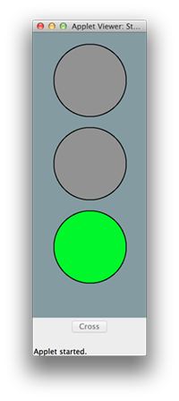
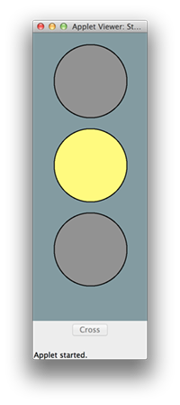
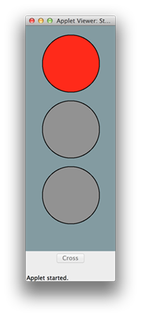

TrafficLight
============

TrafficLight is a Java homework assigned in one of my classes this semester, at Brooklyn College. (Spring 2013)

What It Does:
---
The StopLight class simulates a traffic light at an intersection. The light remains green for 50 seconds, turns yellow for 10 seconds, and then red for 60 seconds. 

The Cross Button:
---
The Cross button becomes enabled when the light is green, but only ten seconds after the light has switched from red to green. Clicking on it accelerates the light, by immediately cycling to yellow. This way, it becomes safe to cross sooner, because the yellow light becomes red after ten seconds.

License:
---
Feel free to inspect my coding style, but don't redistribute it.